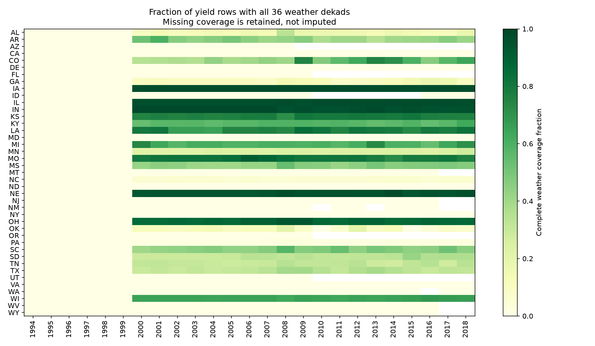

# Agri Data Quality — Audited County Warehouse

Audit public yield, soil and dekadal weather tables, keep explicit coverage gaps, and build an atomic SQLite warehouse with enforced keys and physical constraints.



## Question and source

Can archived county data be joined without silent exclusions or multiplying yield observations? The full [Paudel / de Wit / Boogaard Zenodo archive](https://doi.org/10.5281/zenodo.7751191) contains **45,499 annual yield rows**, **917 soil rows** and **577,980 weather rows**. Yield covers 1994–2018; weather starts in 2000. This engineering project audits the whole archive and differs from the modeling subset in crop-yield-prediction. Sources and derived aggregates are CC BY 4.0; repository code is MIT. [Units and attribution](data/README.md).

## Actual audit results

No source row violates the implemented rules; **zero quarantined rows**, missing cells or duplicate keys were observed. The quarantine mechanism is exercised on clearly artificial unit-test fixtures only. The main quality issue is join coverage: **23,980 yield rows have no soil match**, **29,444 lack all 36 weather dekads**. The **501 zero yields** are retained; their semantics require source review. Unmatched records are coverage warnings, not proof of erroneous yield values.

[Quality report](reports/quality-report.json), [state/year coverage](reports/coverage.csv), [empty real-data quarantine examples](reports/quarantine-examples.csv). Soil water holding capacity/depth units remain unverified; the warehouse preserves their original scale. No quantitative soil-water recommendation is made. VPRES/WSPD/RAD are audited but excluded from the warehouse until their units are confirmed. Weather aggregates cannot support daily hot-day counts.

## Pipeline and database

```text
Official size/hash → three fixed archive entries → key/number/range audit
→ valid rows + explicit quarantine → county dimension and constrained facts
→ annual weather view → one-row-per-yield coverage view → report and SQL analytics
```

All members of a duplicate key group are quarantined; no arbitrary first record is selected. Foreign keys, primary keys, year/dekad checks, nonnegative amounts and temperature ordering are enforced in SQLite. Build into a temporary database, validate integrity and foreign keys, then atomically replace the output. Failure preserves the previous database. Frozen-source rebuild is idempotent. Missing weather/soil remains visible through left joins. Aggregate weather to county-year before joining annual yields, avoiding row multiplication. State/year yields are **unweighted county means**, not production-weighted estimates or causal effects.

## Reproduce (Python 3.12)

```bash
python -m venv .venv
# Activate using your platform's command.
python -m pip install -r requirements-lock.txt
python -m pip install --no-deps -e .
python -m agri_quality.pipeline
python -m pytest -q
```

The pinned 50 MB source downloads automatically. Raw data and the generated 577,980-row weather warehouse remain saved locally under data/ and are ignored in Git. Inspect data/processed/agriculture.sqlite with any SQLite client; [queries](sql/checks.sql) are supplied. [Executed notebook](notebooks/01_evidence.ipynb), [verification](docs/verification.md), [learning guide](docs/learning-guide.md), [interview notes](docs/interview-notes.md), [design](docs/design.md).

This is a static archived-data ETL, not a streaming service or distributed Spark pipeline. Rules detect defined structural problems; they cannot prove source measurement accuracy. No errors, labels or benefits are invented to make the audit look stronger. Development assisted by AI; the learning notes support personal understanding.
